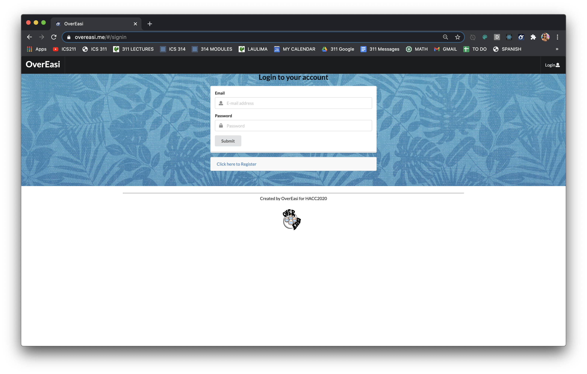

# OverEasi

## Table of contents

* [Overview](#overview)
* [Deployment](#deployment)
* [User Guide](#user-guide)
* [Community Feedback](#community-feedback)
* [Developer Guide](#developer-guide)
* [Development History](#development-history)
* [Contact Us](#contact-us)

## Overview
Although there’s a wide range of information on COVID-19 available on the internet, it can be difficult finding exactly what you need. There’s currently no simple way to find the most up-to-date and accurate information about COVID-19 for Hawaii residents and visitors. Even within just government-sponsored websites like [https://hawaiicovid19.com/](https://hawaiicovid19.com/) and [https://health.hawaii.gov/coronavirusdisease2019/](https://health.hawaii.gov/coronavirusdisease2019/), there is too much to look through. The call centers available are overloaded with people asking questions like “Where is the nearest testing center?” or “What do I do if my family member tested positive?”

The goal of this application is to provide a one-stop-shop for COVID-19 information related to Hawaii. Besides the chatbot, it incorporates the Dialogflow Google Cloud Service, and implements pages accessible only to the admin that allow for easy maintenance of this bot. For example:

1. An “Add Intents” page that enables the admin to fill out a form with fields such as “Intent Name”, “Training Phrases”, and “End Response”.
2. A “View Intents” page that enables the admin to view all intents currently supported by the bot. On this page they may also select an “edit” button redirecting them to a form in which they can edit the different fields, as well as a “delete” button to delete the selected intent.
3. A "View Reports" page that files all the reports submitted by users which the admin has the ability to delete once resolved.

## Deployment

This project is deployed [here](https://overeasi.me/#/).

## User Guide

Interested in seeing the application in action, watch the [OverEasi Demonstration](http://www.youtube.com/watch?v=_rw8uz4mLBo).
#### Landing Page

The user is prompted to the landing page containing the chatbox. Here they are able to make a query to get information pertaining to Covid-19. This can include location of testing centers, symptoms of Covid-19, traveling out of state, etc.

#### Admin Login
Located at the upper right corner of the navbar is a Login designed specially for Admin use. One must have been previously registered as an admin with the system to use this option:

#### Add Intents
The admin has the ability to manage the chatbot by adding more intents, which are phrases that the chatbot uses as response to a particular user input. Admin can also edit and delete any intents.

####  List Intents
The admin will also have access to a  tab that reveal the list of intents currently in the system. Here they have the ability to edit each intent or the option of deleting an intent.

#### User Feedback
To gain feedback with the user experience, the users have the ability to review how a session went and report any problems. These results would be displayed in the admin’s statistics page.

#### Report Submission
Might a user experience technical difficulties or an issue related to the OverEasi chatbot, they are able to submit a report. 

The "Report a problem" button will redirect them to a page that allows them to enter the issue, as well as their name and email.

#### View Report (Admin)
The admin will have access to all the reports submitted. They will have the ability to delete each issue listed if they have been resolved.

## Community Feedback
We are interested in your experience using the OverEasi Chatbot! If you would like, please take a couple of minutes to fill out the [OverEasi Chatbot Form](https://docs.google.com/forms/d/e/1FAIpQLSfKiap-pzjMusGuSkQ-0-TxT3dWRsufpFz8Dt9r2gEDj4eLyA/viewform?usp=sf_link). This will help us understand how to better provide for your service.

## Developer Guide

This project uses meteor to run the site, so first [install meteor](https://www.meteor.com/install) onto your OS:

OSX/Linux

    curl https://install.meteor.com/ | sh

Windows

    choco install meteor

After installing meteor and cloning the repository onto your local computer, cd into the app/ directory and install third party libraries with:

    $ meteor npm install

Now you can run the system with:

    $ meteor npm run start

The app should now be running at [http://localhost:3000/](http://localhost:3000/).
## Development History
##### Milestone 3
The goal of Milestone 3 is to get user feedback on our app and make small quality of life changes. 
Milestone 3 can be found at [OverEasi GitHub Project Board M3](https://github.com/overeasi/overeasi/projects/3).

##### Milestone 2: Data Model Development II
The goal of Milestone 2 was to make finishing touches to the data model and significantly improve the functionality and quality of our application. This included the testing of all pages using the TestCafe. This ensured that all pages of the application are displayed properly and each respective forms (Add Report, Add Intent, Sign-In, Sign-Up, etc.) operate correctly with legal inputs.

Milestone 2 was managed using [OverEasi GitHub Project Board M2](https://github.com/overeasi/overeasi/projects/2).
##### Milestone 1: Mockup and Data Model Development I
The goal of Milestone 1 was to create a set of HTML pages providing a mockup of the pages. In addition, we began phase 1 of implementing the data model. This included the set of Mongo Collections (Reports, Intents, Messages) and the operations supporting additional features of the OverEasi app. The most notable milestone was the implementation of DialogFlow that enabled the functionality of the chatbot itself.

Milestone 1 was managed using [OverEasi GitHub Project Board M1](https://github.com/overeasi/overeasi/projects/1):

## Contact Us
**Eric Lam**
* Email: lameric@hawaii.edu
* [Portfolio](https://airyclam.github.io/)

**Irene Ma**
* Email: mairene@hawaii.edu
* [Portfolio](https://irene-ma.github.io/)

**Shane Severino**
* Email: shanesev@hawaii.edu
* [Portfolio](https://shane-sev.github.io/)

**Alyssandra Cabading**
* Email: alyssand@hawaii.edu
* [Portfolio](https://alyssandra-cabading.github.io/)

