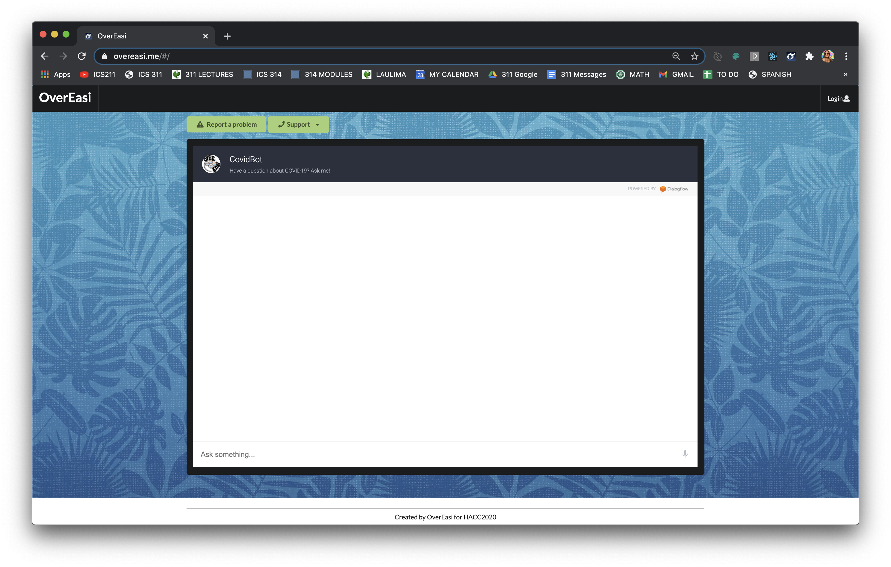
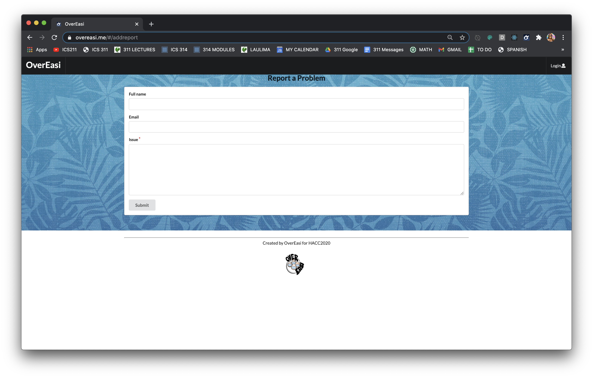
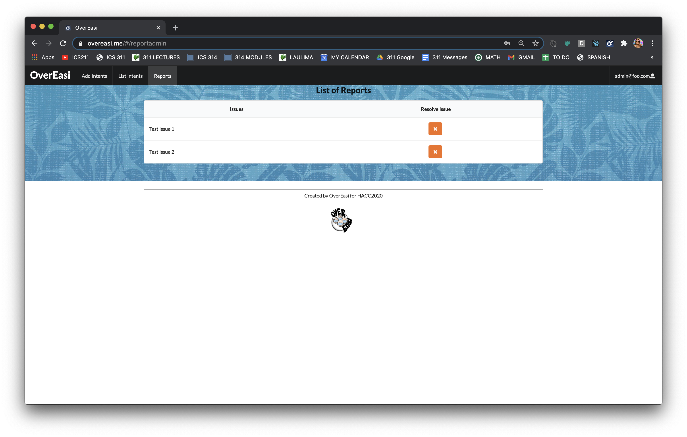

# OverEasi

## Table of contents

* [Overview](#overview)
* [User Guide](#user-guide)
* [Community Feedback](#community-feedback)
* [Developer Guide](#developer-guide)
* [Development History](#development-history)
* [Contact Us](#contact-us)

## Overview
Although there’s a wide range of information on COVID-19 available on the internet, it can be difficult finding exactly what you need. There’s currently no simple way to find the most up-to-date and accurate information about COVID-19 for Hawaii residents and visitors. Even within just government-sponsored websites like [https://hawaiicovid19.com/](https://hawaiicovid19.com/) and [https://health.hawaii.gov/coronavirusdisease2019/](https://health.hawaii.gov/coronavirusdisease2019/), there is too much to look through. The call centers available are overloaded with people asking questions like “Where is the nearest testing center?” or “What do I do if my family member tested positive?”

The goal of this application is to provide a one-stop-shop for COVID-19 information related to Hawaii. Besides the chatbot, which will incorporate the Dialogflow Google Cloud Service, we plan to implement two other pages accessible to the admin that allow for easy maintenance of this bot.

1. An “Add Intents” page that enables the admin to fill out a form with fields such as “Intent Name”, “Training Phrases”, and “End Response”.
2. A “View Intents” page that enables the admin to view all intents currently supported by the bot. On this page they may also select an “edit” button redirecting them to a form in which they can edit the different fields, as well as a “delete” button to delete the selected intent.

## User Guide
#### Landing Page

The user is prompted to the landing page containing the chatbox. Here they are able to make a query to get information pertaining to Covid-19. This can include location of testing centers, symptoms of Covid-19, traveling out of state, etc.

#### Add Intents
The admin has the ability to manage the chatbot by adding more intents, which are phrases that the chatbot uses as response to a particular user input. Admin can also edit and delete any intents.

####  List Intents
The admin will also have access to a statistic tab that reveal which intents have been encountered the most. The statistic will be in a form of a pie chart, exhibiting the frequency of intents across all user sessions with the chatbot. This helps the admin see which type of information about Covid-19 people seek out the most.

#### User Feedback
To gain feedback with the user experience, the users have the ability to review how a session went and report any problems. These results would be displayed in the admin’s statistics page.

#### Report Submission
Might a user experience technical difficulties or an issue related to the OverEasi chatbot, they are able to submit a report. 

The "Report a problem" button will redirect them to a page that allows them to enter the issue, as well as their name and email.

#### View Report (Admin)
The admin will have access to all the reports submitted. They will have the ability to delete each issue listed if they have been resolved.

## Community Feedback
We are interested in your experience using the OverEasi Chatbot! If you would like, please take a couple of minutes to fill out the [OverEasi Chatbot Form](https://docs.google.com/forms/d/e/1FAIpQLSfKiap-pzjMusGuSkQ-0-TxT3dWRsufpFz8Dt9r2gEDj4eLyA/viewform?usp=sf_link). This will help us understand how to better provide for your service.

## Developer Guide

## Development History
##### Milestone 1

_Coming soon_...

##### Milestone 2

_Coming soon_...

##### Milestone 3

_Coming soon_...

## Contact Us
**Eric Lam**
* Email: lameric@hawaii.edu
* [Portfolio](https://airyclam.github.io/)

**Irene Ma**
* Email: mairene@hawaii.edu
* [Portfolio](https://irene-ma.github.io/)

**Shane Severino**
* Email: shanesev@hawaii.edu
* [Portfolio](https://shane-sev.github.io/)

**Alyssandra Cabading**
* Email: alyssand@hawaii.edu
* [Portfolio](https://alyssandra-cabading.github.io/)

